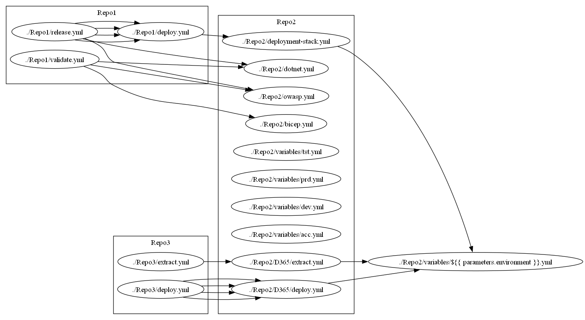

# Azure Pipelines Dependency Graph
Renders a dependency graph of all pipelines under the current directory.

## Examples

    > ./pipeline-viz.ps1 -Mapping @{ SharedTemplates = ".\Repo2\" } -RenderSubgraphs -Export 

    > ./pipeline-viz.ps1 | Export-PSGraph -OutputFormat svg -Destination "deps.svg"

## Dependencies
- [Powershell](https://learn.microsoft.com/en-us/powershell/) (tested with v7.4.1)
- [Graphviz](https://graphviz.org/) (tested with v10.0.1)
- [PSGraph](https://github.com/KevinMarquette/PSGraph) (tested with v2.1.38.27)